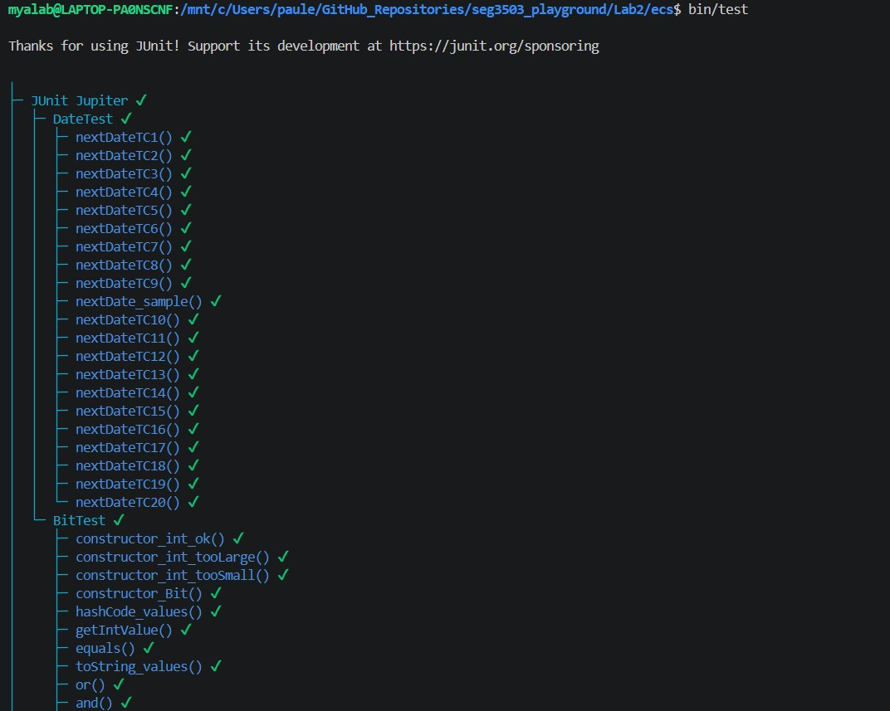
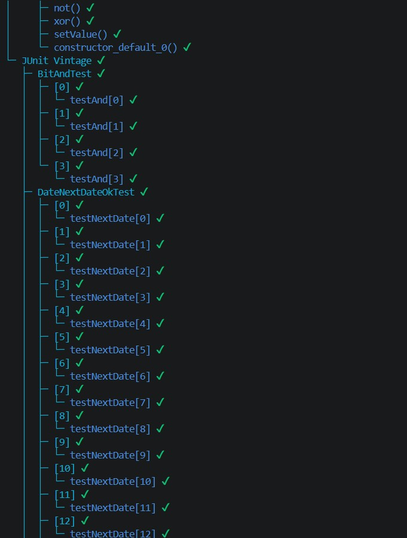
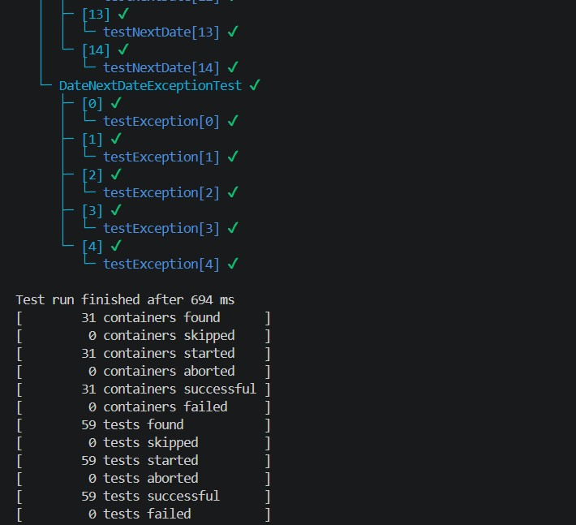
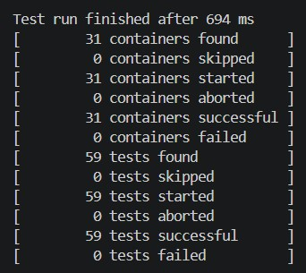
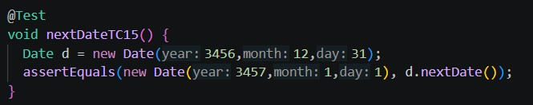
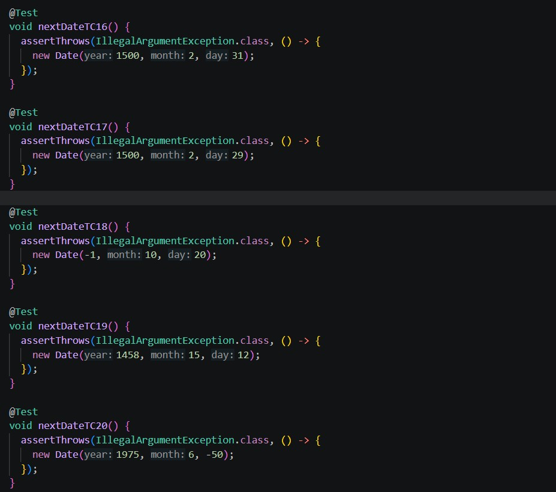
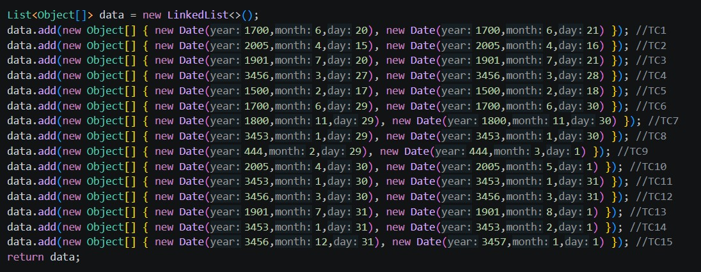
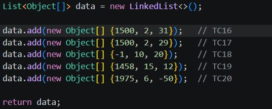

# Lab 2
## Exercice 1
---
Exécutez la commande suivante dans Bash: 
> java --add-opens java.base/java.lang=ALL-UNNAMED -jar user-registration-app-0.1.0.jar

ou
> bin/run

Ensuite, visiter http://localhost:8080/

| Cas de test | Résultats Escomptés | Résultats Actuels | Verdict (Succès, Échec, Non-concluant)| 
| --- | ----------- | --- | --- |
| 1 | Text | 2 images | Succès/Échec/Non-concluant|
| 2 | Text | 2 images | Succès/Échec/Non-concluant|
| 3 | Text | 2 images | Succès/Échec/Non-concluant|
| 4 | Text | 2 images | Succès/Échec/Non-concluant|
| 5 | Text | 2 images | Succès/Échec/Non-concluant|
| 6 | Text | 2 images | Succès/Échec/Non-concluant|
| 7 | Text | 2 images | Succès/Échec/Non-concluant|
| 8 | Text | 2 images | Succès/Échec/Non-concluant|

## JUnit Parameterized Runner
---
résultats obtenus lors de l'exécution du test

## Exercice 2
---
Test run using bin/test:

Typical explicit test case that doesn't use exceptions:

Explicit test cases that have exceptions:

Parameterized test values for test cases that run OK and have a return date:

Parameterized test values for test cases that DO result in an exception:

