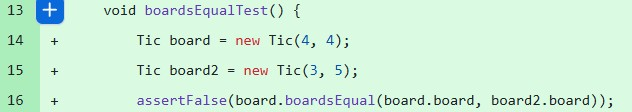
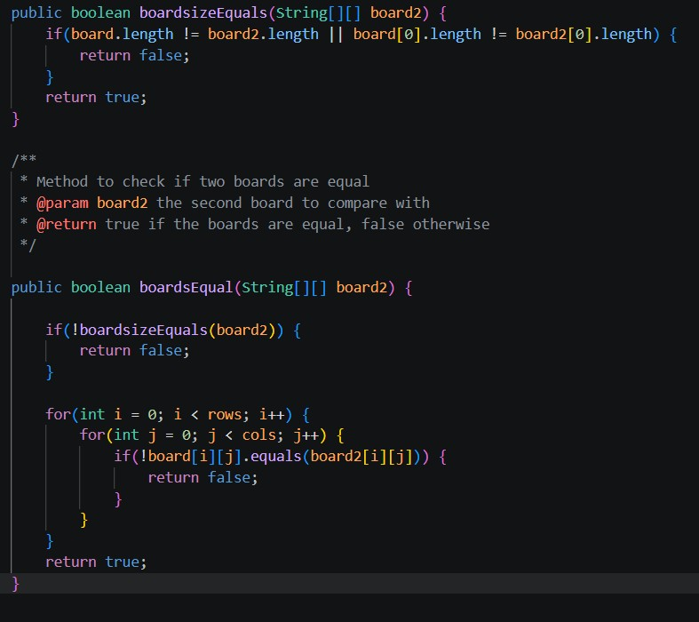
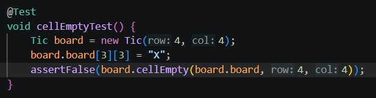
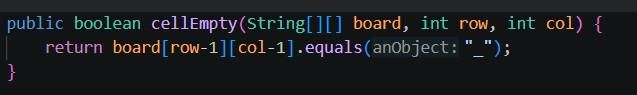
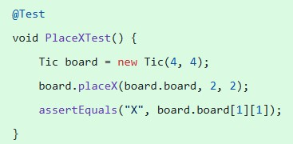
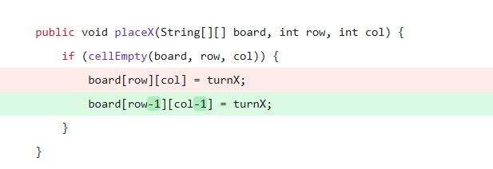
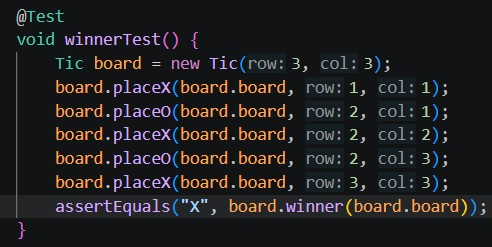
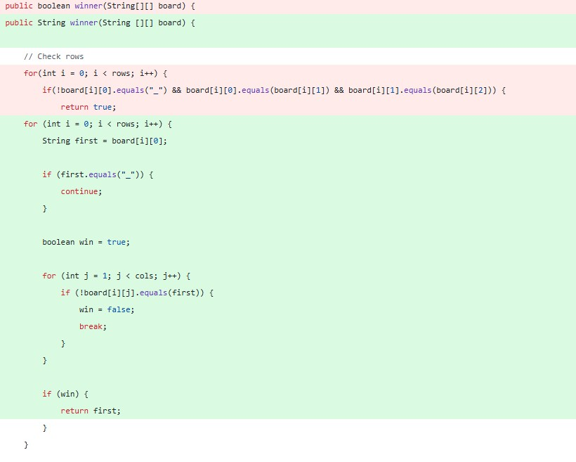
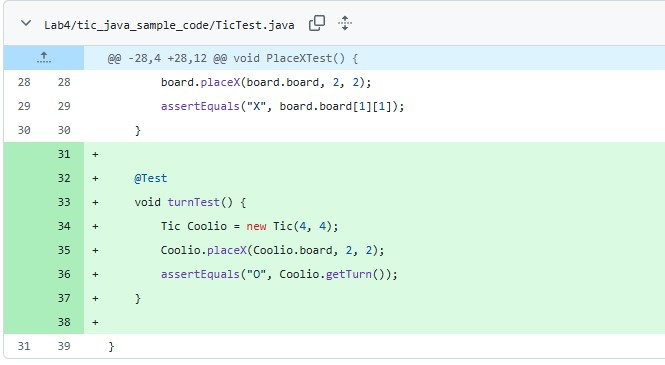
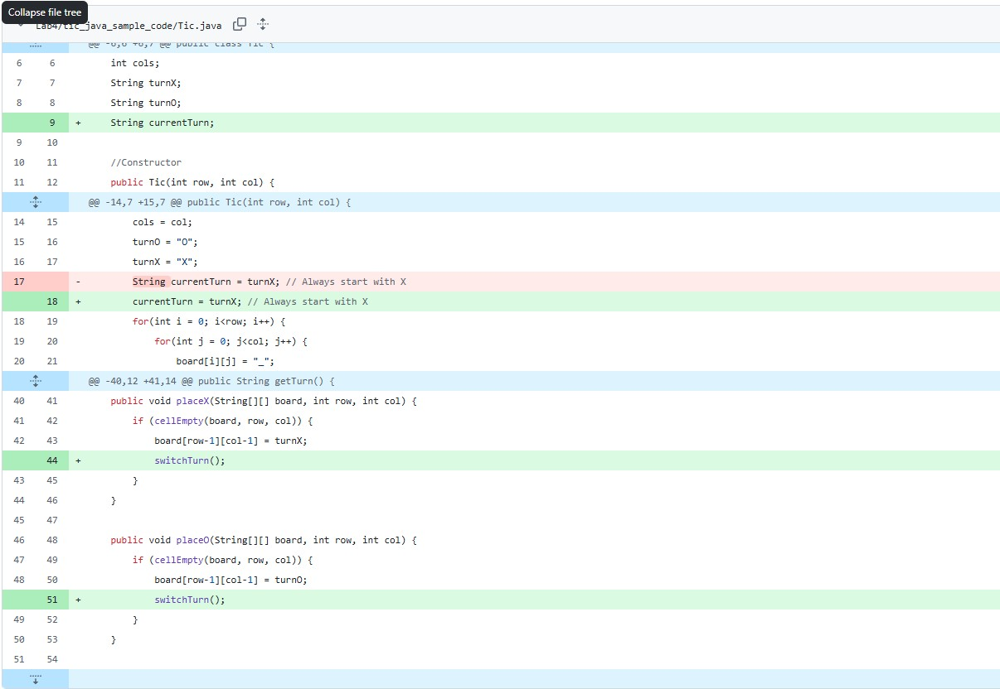

|Nom des commit|Numéros des commits|Descriptions|
|-|-|-|
|boardEquals test fails, boardEquals pass2|9f5586b93145415bfa0fad001fa5c381182fa7c3, da1278b2581f76dffc735f0e3d6d4e443975a6ae|Dans ce groupe, je vérifie si les tableaux sont égals. J’ai penséé vérifier si les valeurs dans chacune des cellules étaient les même et non si les tableaux sont égaux donc j'ai créé une méthode pour vérifier si les tableaux sont de même taille. Test: Implémentation: |
|cellEmpty test fail, cellEmpty pass|9d0dd7147eaa614da1d5f4fa9d795054ef67d1de, f626fe2dd0fc869b4584373d7414d7c7a7eeb728|Vérifie si une cellule est vide ou pas. Quand le tableau est créé, tous les cellules sont "_" donc la méthode vérifie si une cellule est "_". Mon premier test a échoué parce qu'il vérifie une cellule hors du tableau (index out of bounds). Test: Implémentation:  |
|PlaceX test fail, PlaceX pass|8810e96ee461b963816aa91acb6b13fe961e9895, 6abd0e93e519034e26c465fd0e3a886289ac5fcf|Mettre un X dans une cellule vide. Test:  Implémentation:|
|winnerTest fails, winnerTest pass|94b71afa92a2ecf18d7eeb5183119bf14cf368a5, bc8372bf9076db49defeb5b11482102852d9e5d7|Méthode pour vérifier si "X" ou "O" a gagner. En premier je n'ai pas pris compte de la diagonale. Test: Implémentation: |
|turnTest fail, turnTest pass|6301241b6a26d0d49a4153db84ba49f3dc74989b, ea0fb743f4abc60ebaa2e6619d81d2cef172dd5f |Méthode pour savoir c'est le tour à qui. Test:  Implémentation: |