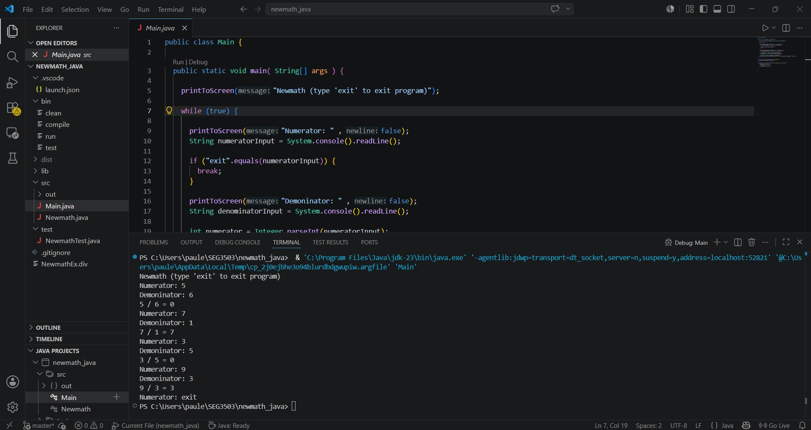
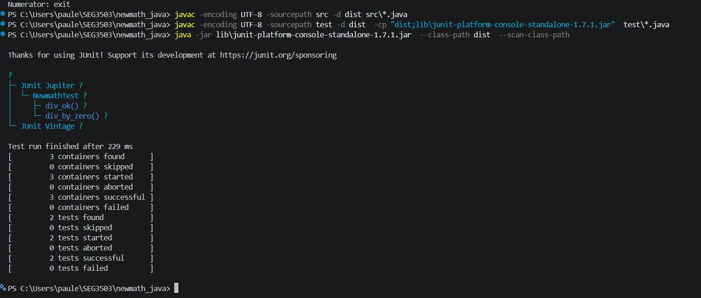
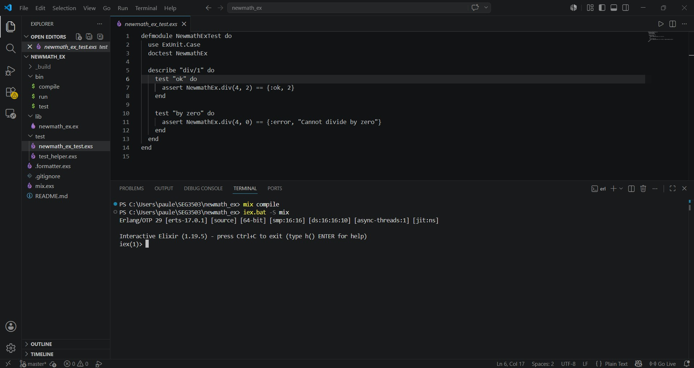
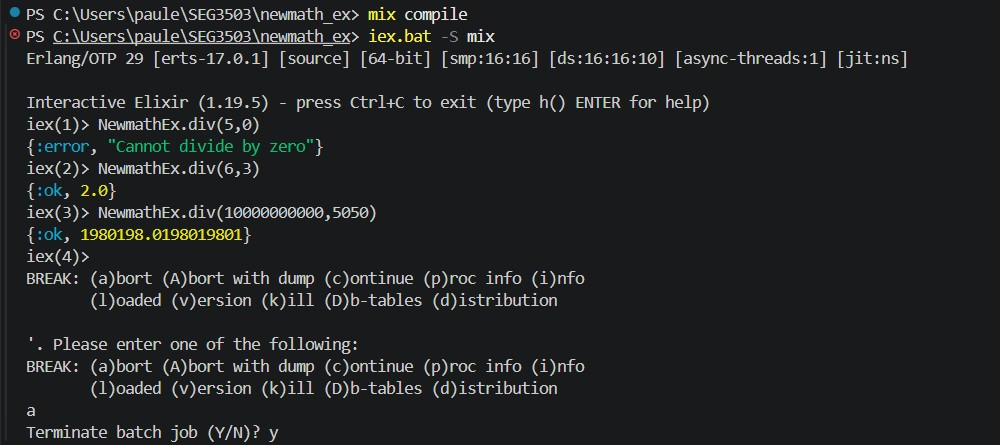
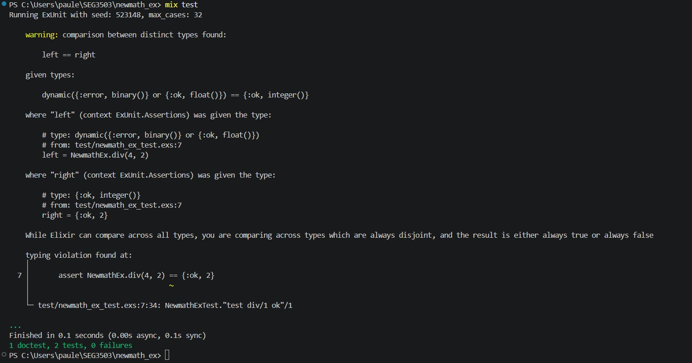

# seg3503_playground
Répertoire pour le cours d'assurance qualité logiciel
# Lab 1
Je travail avec Windows 11 comme système d’exploitation, si vous avez un autre système d’exploitation les instructions peuvent variées. J’utilise Powershell comme terminal.
## Java/JUnit
1. Ouvre le ficher newmath_ex dans visual studio
2. Ouvre Main.java dans le ficher src et executé le code 

1. Pour exécuter les test, écrit «javac -encoding UTF-8 -sourcepath src -d dist src\*.java» dans le terminal
2. Écrit «javac -encoding UTF-8 -sourcepath test -d dist  -cp "dist;lib\junit-platform-console-standalone-1.7.1.jar"  test\*.java» dans le terminal
3. Finalement, écrit «java -jar lib\junit-platform-console-standalone-1.7.1.jar  --class-path dist  --scan-class-path» dans le terminal pour exécuter le test

## Elixir/ExUnit
1. Ouvre le ficher newmath_ex dans visual studio
2. Ouvre le terminal 
3. Compile le projet avec «mix compile»
4. Run elixir avec «iex.bat -S mix» ou «iex -S mix», L’image ci-dessous devrait apparaître:
 

1. Écrit «NewmathEx.div(X,Y)» En remplacant X et Y avec des nombres et appuyez sur entrée. Lorsque vous avez terminé, appuyez sur Ctrl+C pour sortir.
 
1. Pour lancer les tests, tapez « mix test »
 